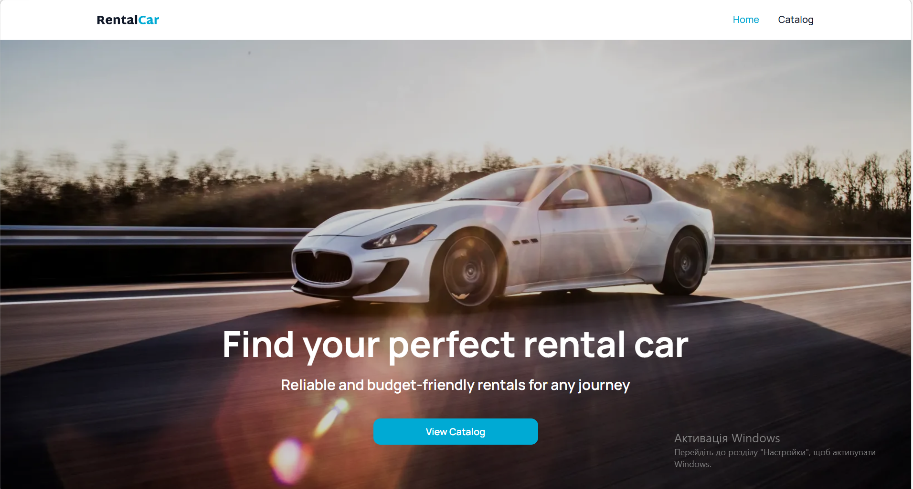

<h1 align="center">🚗 Car Rental App</h1>
<p align="center">A modern web application for browsing, filtering and booking rental cars</p>

### 📌 Description

RentalCar is a modern frontend web application designed for a car rental company. It provides users with a seamless experience to browse a catalog of available vehicles, apply advanced filters, and view detailed specifications for each car before booking.

The project is built with **Next.js (App Router)** and **TypeScript**, focusing on performance, SEO, and a smooth user experience.

## 🔗 Preview

<p align="center">
  
</p>

<p align="center">
  <!-- [](https://rentalcar-theta.vercel.app/) -->
  <a href="https://rentalcar-theta.vercel.app/">🌐 Live Demo</a> •
  <a href="https://github.com/Valentyna877/rentalcar">📁 GitHub Repository</a>
</p>

---

## ✨ Main Features

- **Home Page**: Engaging hero section with a clear call-to-action to start browsing.
- **Interactive Catalog**: A dynamic list of cars fetched from a REST API.
- **Advanced Filtering**: Users can filter the catalog by:
  - Brand (single selection)
  - Price (single selection)
  - Mileage (min and max values)
- **"Load More" Pagination**: Efficient data fetching using TanStack Query's `useInfiniteQuery` to load additional cars while keeping active filters applied.
- **Dynamic Car Details**: Dedicated pages for each vehicle (`/catalog/[carId]`) with high-quality images, specifications, rental conditions, and a functional rental form.
- **SEO Optimization**: Dynamically generated metadata and OpenGraph tags for individual car pages.

## 🛠️ Tech Stack

- **Framework:** [Next.js](https://nextjs.org/) (App Router)
- **Language:** [TypeScript](https://www.typescriptlang.org/)
- **State Management / Data Fetching:** [TanStack Query](https://tanstack.com/query/latest) (React Query)
- **Axios**
- **Zustand**
- **Yup**
- **React DatePicker**
- **Styling:** CSS Modules
- **Icons:** SVG Sprite

## 🚀 Installation and Usage

To run this project locally, follow these steps:

### Prerequisites

Make sure you have [Node.js](https://nodejs.org/) installed on your machine.

### 1. Clone the repository

```bash
git clone [https://github.com/](https://github.com/)[TeaRediT]/[rental-car].git
```

### 2. Navigate to the project directory

cd [rental-car]

### 3. Install dependencies

npm install

or

yarn install

### 4. Setup Environment Variables

Create a .env file in the root of your project and add your API endpoint:

NEXT_PUBLIC_API_URL=[https://car-rental-api.goit.study](https://car-rental-api.goit.study)

### 5. Start the development server

npm run dev

or

yarn dev

Open http://localhost:3000 in your browser to see the result.

👤 Author
FullStack Developer Valentyna

GitHub: [@Valentyna877](https://github.com/Valentyna877)

LinkedIn: [Valentyna Shpakivska-Aydemir](https://www.linkedin.com/in/valentyna-shpakivska-aydemir/)

This project was created as a test assignment.
